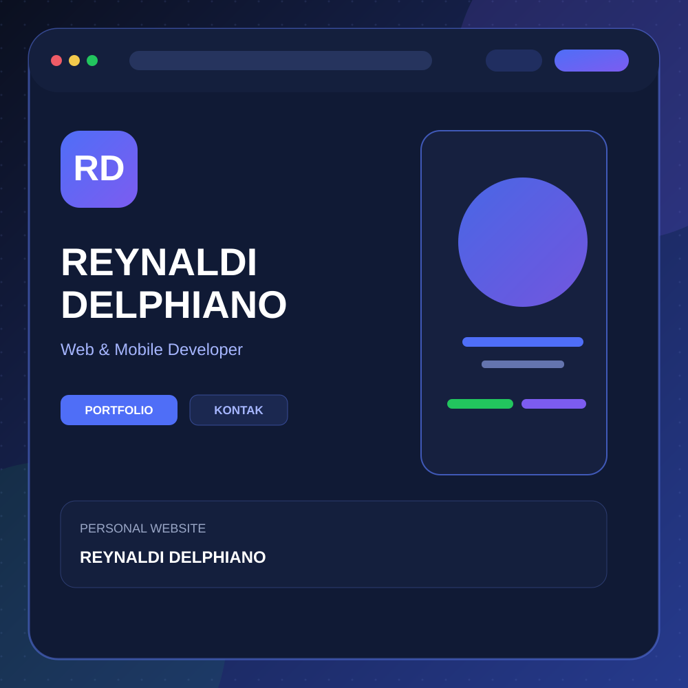

<p align="center">
  
</p>

<h1 align="center">Reynaldi Delphiano — Portfolio Website</h1>

<p align="center">
  Website portofolio pribadi <strong>Reynaldi Delphiano (ReyDel)</strong> — Web & Mobile Developer.
  Menampilkan profil profesional, pengalaman kerja, pendidikan, skill, proyek, pelatihan, dan sertifikasi dalam satu halaman yang responsif.
  Mendukung <strong>dua bahasa</strong> (Indonesia & English) dengan tombol pergantian di navbar.
</p>

<p align="center">
  
  
  
  
</p>

<p align="center">
  <a href="http://reydel.page.gd/"></a>
  <a href="https://github.com/ReyDel6/ReyPortofolio"></a>
</p>

---

## 🖥️ Tentang Website

Website ini adalah halaman portofolio satu halaman (_single page_) milik **Reynaldi Delphiano**, yang menampilkan:

- **Profil profesional** — ringkasan diri, fokus pengembangan, dan tautan media sosial.
- **Showcase proyek** — UMKM Connect (Web & Mobile) beserta fitur, dokumentasi, dan hak cipta.
- **Pengalaman & pendidikan** — riwayat karir lintas bidang (teknis, perbankan, penjualan, kepemimpinan) dan riwayat pendidikan.
- **Skill & teknologi** — stacks yang dikuasai (Laravel, React, Flutter, dsb.).
- **Pelatihan & sertifikasi** — program pelatihan PPKPI dan galeri sertifikat dengan link PDF.
- **Responsive design** — tampilan menyesuaikan desktop, tablet, dan mobile.
- **Bilingual (ID/EN)** — beralih bahasa via tombol `ID | EN` di navbar; pilihan disimpan di cookie.

## 🚀 Cara Menjalankan

Website dibangun dengan **PHP murni** — tanpa Composer, tanpa dependency, tanpa database. Cukup jalankan dengan PHP built-in server:

```bash
cd webphp
php -S localhost:8000 -t .
```

Lalu buka [http://localhost:8000](http://localhost:8000) di browser.

> **Catatan:** gunakan flag `-t .` agar root folder tepat (mencegah error 404 "Not Found").

Alternatif: taruh isi folder `webphp` di document root web server (Apache/nginx) atau hosting PHP (mis. InfinityFree).

## 📁 Struktur Folder

Website kini menggunakan **layout multi-page**:

```
webphp/
├── index.php        # Beranda (hero + menu utama)
├── about.php        # Tentang, pengalaman, pendidikan, pelatihan
├── projects.php     # Proyek (kartu + modal detail)
├── certificates.php # Skill & teknologi + sertifikat
├── contact.php      # Kontak & sosial media
├── data.php         # Resolver bahasa: memilih data_en.php / data_id.php
├── data_id.php      # Pusat data versi Indonesia (profil, proyek, pengalaman, skill, sertifikat)
├── data_en.php      # Pusat data versi English (struktur identik dengan data_id.php)
├── inc/             # Partial header & footer + inc/lang.php (sistem bahasa & kamus UI)
├── css/
│   └── style.css    # Styling seluruh halaman
├── js/
│   └── main.js      # Interaktivitas: modal, command palette, skill filter, back-to-top
└── assets/          # Gambar, logo, preview proyek, PDF sertifikat, dan APK
```

## ✏️ Mengedit Konten

Konten website terpusat di **satu struktur data** yang disediakan dalam dua versi bahasa:

- `data_id.php` — konten **Indonesia**
- `data_en.php` — konten **English**

Ubah teks di kedua file agar terjemahan tetap sinkron. Struktur array pada kedua file **harus identik** (jumlah baris data sama), hanya isi teksnya yang berbeda.

```php
// Contoh: mengubah profil (di data_id.php dan data_en.php)
$profile = [
    'name' => 'Reynaldi Delphiano',
    'role' => 'Web & Mobile Developer',
    // ...
];
```

- `$projects` — daftar proyek (UMKM Connect Web, Portfolio, UMKM Connect Mobile).
- `$experiences` — riwayat pekerjaan.
- `$trainings` — program pelatihan.
- `$skills` / `$techSkillPills` — keahlian dan teknologi.
- `$certificates` — sertifikat & piagam.

Setelah mengubah data, halaman otomatis ter-update tanpa mengedit template. Teks antarmuka (navbar, tombol, judul section) diatur di `inc/lang.php` melalui fungsi `t('key')`.

## 🌐 Sistem Bahasa (Bilingual)

- Deteksi otomatis: `?lang=` di URL → cookie `lang` → bahasa browser → default `id`.
- Tombol `ID | EN` di navbar untuk berpindah bahasa; pilihan disimpan di cookie (365 hari).
- Konten & data: `data_id.php` / `data_en.php`.
- Teks UI halaman & `window.I18N` (untuk JS toggle): `inc/lang.php`.

## 🧭 Navigasi Halaman

| File | Isi |
|------|-----|
| `index.php` | Beranda — hero + menu utama |
| `about.php` | Tentang, pengalaman profesional, pendidikan, pelatihan |
| `projects.php` | Proyek beserta modal detail setiap proyek |
| `certificates.php` | Skill & ekosistem teknologi, sertifikat & lisensi |
| `contact.php` | Kontak & kanal sosial media |

Navbar di `inc/header.php` menandai halaman aktif lewat variabel `$activePage` yang di-set di awal tiap halaman.

## 🛠️ Teknologi

| Bagian    | Teknologi                          |
|-----------|------------------------------------|
| Backend   | PHP (standalone, tanpa framework)  |
| Frontend  | HTML, CSS, JavaScript              |
| Icon/SVG  | Inline SVG + aset lokal            |
| UI        | Responsive design                  |

## 🌟 Fitur Proyek Unggulan (UMKM Connect)

Website juga mendokumentasikan **UMKM Connect**, platform digital untuk UMKM karya Reynaldi Delphiano:

- **Kasir/POS** — dashboard, manajemen shift, pesanan meja, ID card digital kasir.
- **QR Meja** — pelanggan scan QR, lihat menu, pesan & bayar online.
- **Marketplace B2B** — toko online antar-UMKM dengan keranjang & checkout grosir.
- **Manajemen karyawan** & multi-role (Owner, Admin, Cashier, Supplier, Customer).
- **Pembayaran Midtrans** dan **Hak Cipta terdaftar** (DJKI).

## 📬 Kontak

- **Email:** [delphianor@gmail.com](mailto:delphianor@gmail.com)
- **LinkedIn:** [Reynaldi Delphiano](https://www.linkedin.com/in/reynaldi-delphiano-2b6b79120)
- **GitHub:** [ReyDel6](https://github.com/ReyDel6)
- **Instagram:** [@reynaldi_delphiano_](https://instagram.com/reynaldi_delphiano)
- **WhatsApp:** [085155376508](https://wa.me/6285155376508)
- **YouTube:** [@reynaldidelphiano5684](https://www.youtube.com/@reynaldidelphiano5684)

## 📄 Lisensi

Konten website ini (termasuk data profil, source code, dan aset) adalah karya **Reynaldi Delphiano**. Proyek **UMKM Connect** merupakan karya orisinal yang dilindungi Hak Cipta dan dicatatkan di DJKI (HKI **EC002026133137**, 2026).
